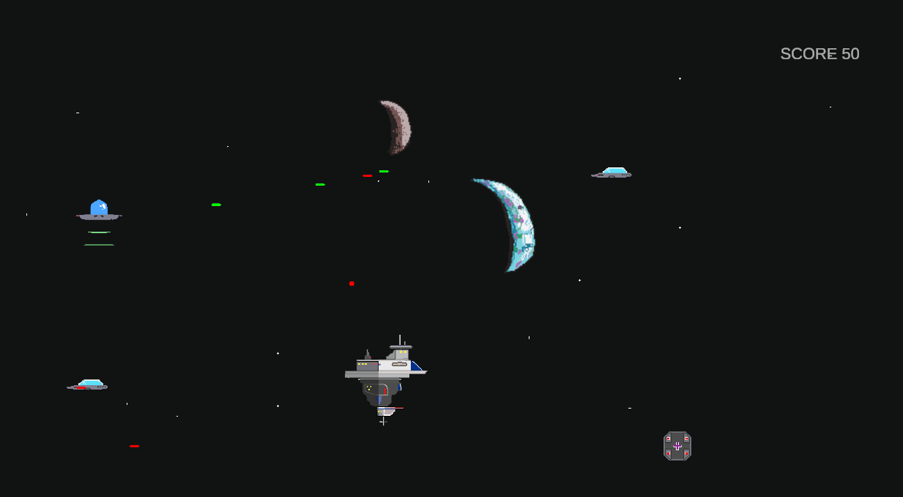

# Space Advature Game with Unity and Pixel Studio
---
A pixel-art infinite runner game developed using Unity, C#, and Pixel Studio. This project combines retro-inspired graphics with smooth gameplay mechanics to deliver an enjoyable and engaging gaming experience. Below is a brief overview of the game and its core features.
### Features
---
1.Pixel Art World: Designed with Pixel Studio, the game has retro-style looks.
2.Player Mechanics: Flying and shooting, smooth and responsive player controls.
3.Sound Effects: Retro-inspired sound effects enhance the gameplay experience.
4.Scoring System: As long as the player stays alive, he gains points.
5.Game Over and Restart: Restarts in any collision.

### Technologies
- Unity 2D
- C#
- Pixel Studio
